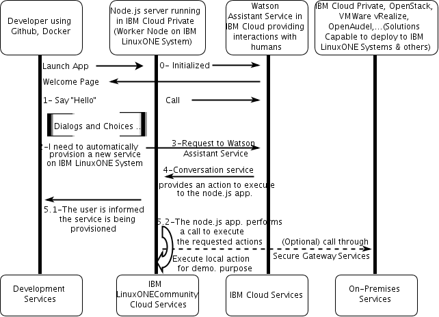
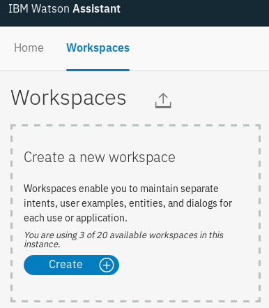
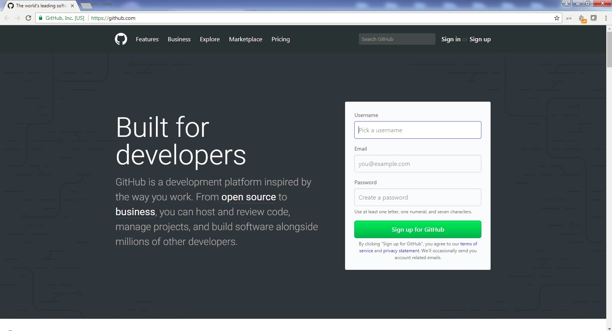
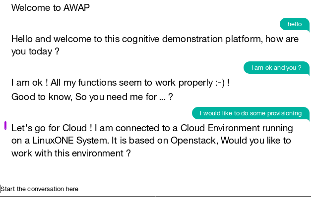

# IBM Watson Assistant Journey with IBM LinuxONE Systems

In this Code Pattern, you will learn how to build and deploy a cognitive microservice with IBM Cloud private running in the IBM LinuxONE Community Cloud. 

IBM Cloud Private is a private cloud platform for developing and running workloads locally. It is an integrated environment that enables you to design, develop, deploy and manage on-premises, containerized cloud applications behind a firewall. It includes the container orchestrator Kubernetes, a private image repository, a management console and monitoring frameworks.

When you will complete this Code Pattern, you will understand how to:

* Create an IBM Watson Assistant Service in IBM Cloud
* Build a Docker image from an existing application.
* Deploy a Docker image to IBM Cloud Private.
* Deploy an existing application using the IBM Cloud Private catalog.
* Talk & get it done with IBM LinuxONE systems !

# Architecture

This journey provides a chatbot interface to demonsrate how you can simply integrate with an IBM LinuxONE System or, potentially any other system. IBM Cloud private has been configured into the LinuxOne LinuxONE Community Cloud.

## Overview
1. The user creates a Cognitive service with an IBM Watson Assistant Service in IBM Cloud and load a pre-defined corpus,
2. The user code and create a Docker image (Node.js application based microservice) & publish it to the IBM Cloud Private Docker registry.
3. The user configures and runs a container based on the previous Docker image from IBM Cloud Private catalog.
4. A chatbot interface allows the user to "discuss" with the IBM LinuxONE System to deploy cloud services (execute actions).
5. The developer can extend this pattern to interact with its own on-premises servers using an IBM Secure Gateway service from IBM Cloud.

## Sequence Diagram Overview
Here is an overview of the interactions betwwen each layer of this code pattern. 

# Included components

* [IBM LinuxONE Systems](https://www.ibm.com/it-infrastructure/linuxone)
* [IBM Z (Mainframe)](https://www.ibm.com/it-infrastructure/z)
* [IBM Cloud Private](https://www.ibm.com/cloud/private)
* [OpenStack](https://www.openstack.org/)
* [Integration with VMWare vRealize Automation](https://www.ibm.com/blogs/systems/making-hybrid-cloud-easier-vmware-ibm-systems/)
* [Watson Assistant](https://www.ibm.com/watson/ai-assistant/)

# Featured technologies

* Open source technologies : Docker, Kubernetes, Node.js, OpenStack
* IBM Systems: IBM LinuxONE Systems, IBM Z
* IBM Private Cloud (ICP) solution
* Cognitive/AI technologies: Watson Assistant (aka. "Conversation Service")
* Partner solution (possible extensions): IBM VMWare vRealize Automation (vRA)
this is an update for LSU of my application* Integration services: Rest APIs of OpenStack and vRA, IBM Secure Gateway services

# Steps

<!-- https://ecotrust-canada.github.io/markdown-toc/ -->

- Step 1 - Create an IBM Watson Assistant Service & Configure it
- Step 2 - Build and deploy a Docker image to IBM Cloud private
	- [Part 1 - Build the Docker image from the LinuxOne Community Cloud](#part-1---build-the-docker-image-from-the-linuxone-community-cloud)
	- [Part 2 - Deploy the Docker image to IBM Cloud private](#part-2---deploy-the-docker-image-to-ibm-cloud-private)
- Step 3 - Instantiate the provisiong chatbot from the IBM Cloud private catalog
- Step 4 - Run the application: Talk and get it done with IBM LinuxONE Systems
- Step 5 - Extend this solution to access your on-premises servers

# Step 1 - Create an IBM Watson Assistant Service

- Create the following service and name it provisioning-conversation-service:
[Watson Assistant Service](https://console.bluemix.net/catalog/services/conversation)

- Get IBM Cloud service credentials and add to .env file

As you create the IBM Cloud services, you'll need to create service credentials. You might get either IAM or username/password based credentials based on the region.

First of all, move the provisioning-conversation-service/env.sample file to provisioning-conversation-service/.env.

    Look after the service credentials from IBM Watson Assistant and note the username/password. You will have to update the app.js file in the section // CHANGE HERE WITH THE YOUR_USERNAME AND YOUR_PASSWORD PROVIDED IN YOUR IBM WATSON ASSISTANT SERVICE

Now configure using launch tool button :

Next, you have to create a new workspace:

Now use the **Import** feature for the file **AWAPlinuxonecc/training/workspace-WatsonAssitantAwap.json** to upload the Assistant Intents, Entities, and Dialog Nodes.

Find the Workspace ID by clicking on the context menu of the new workspace and select **View details**

    Again, here you will have to update the app.js. Look and change for the value of YOUR_WORKSPACEID and replace it with the value you found above.
   

# Step 2 - Discover and locally run the provisioning chatbot application

The objective is to discover the provisioning chatbot in the *AWAPlinuxonecc* folder. This application is a Node.js application. It will be locally tested before packaging it into a Docker image for IBM Cloud private.

## Part 1 - Discover the provisioning chatbot application

1. Create a [GitHub account](https://github.com/).

	
	* Pick a username. This will be referenced later as "YOUR_USERNAME".
	* Enter an email.
	* Create a password.
	* Click **Sign up for GitHub**.
	* Select the plan *Unlimited public repositories for free*.
	* A Confirmation email will be sent. Verify your email address to collaborate in Github.

2. Fork the provisioning chatbot application from this GitHub repository to your own GitHub repository.

	
	* Click **Fork**.
	* Github automatically forks this project from this repository *IBM/conversation-with-linuxone-using-watson-microservices* to your repository *YOUR_USERNAME/conversation-with-linuxone-using-watson-microservices*.
	* Discover your forked project (your fresh provisioning chatbot application) in your Github repository *YOUR_USERNAME/conversation-with-linuxone-using-watson-microservices*.

3. Install the [Git command line interface](https://git-scm.com/book/en/v2/Getting-Started-The-Command-Line) to manage your GitHub repository. Git has three main commands:
	* *git clone* is the command for creating a local copy of the source code from a GitHub repository.
	* *git pull* is the command for pulling fresh code from a GitHub repository.
	* *git push* is the command for pushing new code to a GitHub repository.

4. Launch a terminal and clone your GitHub repository *conversation-with-linuxone-using-watson-microservices* to create a local copy of your banking application:

   `git clone https://github.com/YOUR_USERNAME/conversation-with-linuxone-using-watson-microservices`
    
	

## Part 2 - Run locally the provisioning chatbot application

In order to run the provisioning chatbot application, you need to install the following components for your environment (Windows, Mac OS, Linux):

    Node.js: Node.js is a javascript application server.
    npm: npm resolves Node.js package dependencies. According to your operating system, npm may be distributed with Node.js.

Ensure you can execute **node -v** and **npm -v** commands from a command line interface.

1. Using your command line, move to your local folder where you clone the git repository 
2. Install the Node.js packages dependencies by running the **npm install** command.

Before running the application, **remember to modify the file app.js** as indicated in Step 1, in "blue sections".

3. So now, you should be ready to run the application locally using the following command **node server.js**
4. Open a browser and point to localhost:3000 .
5. Nice ! You should get a page to the chatbot application. 

Here is a starting conversation example*, start with **Hello**
*you may express it differently and make also the system learn through the IBM Watson Assistant Service by adding new intents, entities and dialogs if you need !

CONGRATULATIONS ! You are done with the first part of this code patten ! Now we are going to pakage and deploy the provisioning chatbot application for IBM Cloud Private in order to deploy it to IBM LinuxONE Systems.

# Step 3 - Instantiate the provisiong chatbot from the IBM Cloud private catalog

Helm chart to create and to be loaded in the ICP environment.

# Step 4 - Run the application: Talk and get it done with IBM LinuxONE Systems

kubectl run YOUR_SERVICE --image=DOCKERHUB/YOUR_DOCKERIMAGE

# Step 5 - Extend this solution to access your on-premises servers

Looking to the file **Action.js**, you can now modify the command it contains. Change the localhost value to the ip address of your choice to point to your on-premises server.
In order to establish the commuication with your on-premises server you need to create another IBM Cloud Service for Integration.
